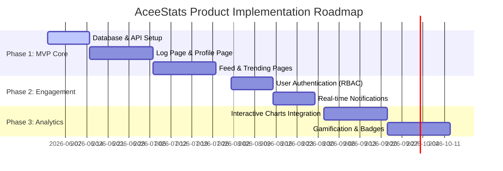

# Product Requirements Document (PRD)

## Project: AceeStats (Student Activity Tracking Platform)

| Attribute | Details |
| :--- | :--- |
| **Document Version** | v1.1.0 |
| **Status** | Approved |
| **Target Launch** | Q3 2026 |
| **Author** | Antigravity AI |

---

## 1. Executive Summary & Vision

### 1.1 Problem Statement
In school and university ecosystems, students participate in a wide array of extracurricular activities—ranging from student government and academic clubs to arts, culture, and community service. However, there is rarely a centralized, cohesive platform where students can structuredly document their involvement, rate their experiences, compile visual proof, and showcase their portfolio to peers or external stakeholders (like college admissions or employers).

### 1.2 Product Vision
**AceeStats** is designed to bridge this gap. It is a premium, highly interactive student activity tracking and social logging platform. It serves a dual purpose:
1. **Personal Dashboard:** A digital portfolio for logging, rating, and reflecting on individual extracurricular involvement.
2. **Social Hub:** A collaborative space where students can discover active student organizations, follow their classmates' activity feeds, and stay inspired.

---

## 2. Target Audience & User Personas

### 2.1 User Personas
* **Persona A: "The Overachieving Logger" (e.g., Ethan Sterling, 18, University Freshman)**
  * *Needs:* Ethan is a freshman at the **University of the Philippines Diliman**. He is highly active in robotics and student government. He wants a quick, visually pleasing way to document all his achievements, rate his enjoyment of activities, and keep a clean log of his involvement to build a stellar portfolio for college applications or internships.
  * *Pain Points:* Existing tools are too generic (like spreadsheets) or too professional (like LinkedIn, which feels intimidating and lacks student-specific tracking).
* **Persona B: "The Community Explorer" (e.g., Sarah Jennings, 17, High School Senior)**
  * *Needs:* Sarah is at **Ateneo de Manila University** and wants to see which student organizations are highly active and popular. She wants to browse classmates' feeds to discover interesting clubs and express her interest in joining them.

---

## 3. Functional Requirements & Feature Specifications

### 3.1 Feature Group 1: Activity Logging System (Log Page)
Allows students to catalog their experiences with comprehensive details.

* **FR-1.1: Activity Entry Creation**
  * The system must allow users to input a descriptive **Title** and **Detailed Description**.
  * The system must support selecting/entering the **Organization Name** and **Activity Date**.
* **FR-1.2: Image Uploads/Attachments**
  * Users must be able to upload or attach supporting photos/images as proof of participation or visual memories (via dynamic Base64 FileReader encoding).
* **FR-1.3: 1–5 Star Rating System**
  * Users must be able to assign a rating (1 to 5 stars) to reflect their enjoyment, learning value, or overall experience using custom hover-scaled SVG stars.
* **FR-1.4: Activity Category Tagging**
  * Support selecting categories such as: *Student Government*, *Academic Clubs*, *Arts & Culture*, *Sports & Athletics*, *Community Service*.
* **FR-1.5: Associated School / Campus**
  * Users can associate a specific campus/school in the Philippines where the activity took place (defaults to the user's primary school).

### 3.2 Feature Group 2: Student Dashboard (Profile Page)
A comprehensive summary of a student's extracurricular identity.

* **FR-2.1: Profile Personalization**
  * Displays user metadata: Username, Bio, and Student Profile Avatar/Image.
* **FR-2.2: 🏫 Primary School Badge**
  * Prominently displays the student's current school in the Philippines (e.g., *University of the Philippines Diliman*, *De La Salle University*, *Ateneo de Manila University*).
* **FR-2.3: 🔥 Gamified Streak Counter**
  * Calculates and displays a dynamic "Activity Streak" (e.g. *5 Week Streak*) based on the user's active logs count. Featuring a custom glowing and pulsing CSS animation.
* **FR-2.4: Rating Distribution Summary**
  * A dedicated UI component (such as a visual bar chart or breakdown list) showing the total count of logs for each star rating (from 5 stars down to 1 star), with stagger-animated progress fills.
* **FR-2.5: Featured/Favorite Activities**
  * Highlights the user’s **Top 4** activities (curated by high rating or user selection) in a prominent grid layout featuring hover-zoom card triggers.
* **FR-2.6: Chronological Activity Stream**
  * Lists all recent logs created by the user in reverse chronological order, showing school metadata.

### 3.3 Feature Group 3: Social Hub & Timeline (Feed Page)
Fosters community engagement and transparency.

* **FR-3.1: Three-Column Layout**
  * **Left Column (Classmates Directory):** Lists friends and classmates in the school community with online/offline status pulses and their respective schools.
  * **Center Column (Timeline):** Displays a scrollable feed of recent activity logs posted by friends/classmates, showing their name, school, activity details, rating stars, and attached images.
  * **Right Column (Quick Actions & Analytics):** Quick navigation shortcuts and a **📊 Live User Metrics Panel** that computes dynamic stats in real time (Total Logs, Average Rating, and Top Category).
* **FR-3.2: Social Interactions**
  * Users can interact with their peers' logs through animated click reactions ("Clap", "Support").

### 3.4 Feature Group 4: School Organization Analytics (Trending Page)
Aggregates activity data to show community engagement.

* **FR-4.1: Active Organizations Ranking**
  * Ranks student organizations by the volume of logged student activities.
* **FR-4.2: High-Interest Tracking**
  * Highlights "highly desired" clubs by showcasing which organizations students are expressing the most interest in joining.
* **FR-4.3: Engagement Metrics**
  * Visualizes top-ranked organizations on a custom 1st-2nd-3rd place podium. Updates dynamically when users click "Want to Join".

---

## 4. Non-Functional Requirements

### 4.1 UI/UX & Aesthetics
* **Premium Theme:** Modern design with vibrant HSL green primary shades, smooth dark mode transitions, and glassmorphism.
* **Micro-Animations:** Interactive elements (buttons, rating stars, cards) must have subtle CSS hover transitions, scales, and active state changes.
* **Branded Iconography**: Dynamic favicon using the custom Gemini-generated logo.

### 4.2 Accessibility & Usability
* **Dark Mode:** A toggle to seamlessly transition between premium light and high-contrast dark modes, persisting settings across sessions.
* **Responsive Layout:** The design must adapt gracefully to desktop, tablet, and mobile displays.

### 4.3 Data & Performance
* **Storage:** Relational schema (MySQL) simulated via a persistent browser LocalStorage database (MockDB) for zero-setup ease of use.
* **Performance:** Ensure fast page loading with lazy-loading for images and optimized JSON api routing.

---

## 5. Product Roadmap

