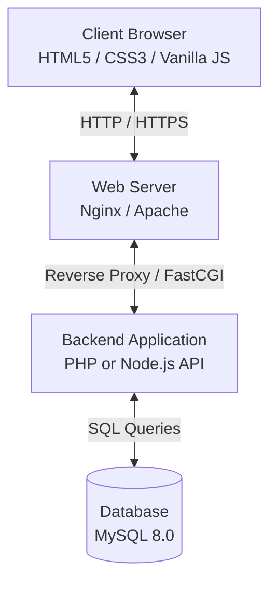
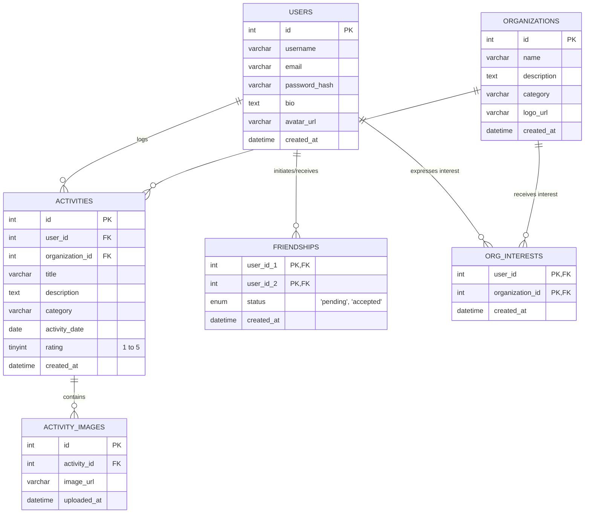

# System Design Document (SDD)

## Project: AceeStats (Student Activity Tracking Platform)

| Attribute | Details |
| :--- | :--- |
| **Document Version** | v1.0.0 |
| **Status** | Draft |
| **Database Engine** | MySQL 8.0+ |
| **Architecture Pattern** | Client-Server (REST API / Multi-Page or Single-Page Application) |

---

## 1. System Architecture

The AceeStats system follows a standard three-tier software architecture:



### Architectural Components:
1. **Presentation Layer (Frontend):** 
   - Multi-page application structure built with static HTML, premium CSS (green theme with glassmorphism), and dynamic Vanilla JavaScript.
   - Communicates asynchronously via `fetch` API to retrieve data from the backend without full-page reloads.
2. **Application Layer (Backend):**
   - Implements a RESTful JSON API.
   - Handles authentication validation, input sanitization, file uploads (for activity proof images), and aggregates data for trending analytics.
3. **Database Layer (MySQL):**
   - Relational database storing user records, activity logs, image mappings, friend associations, and organization engagements.

---

## 2. Database Schema Design

The application utilizes a fully normalized MySQL relational database. Below is the Entity Relationship (ER) structure:



### Table Structure Definitions

#### 1. `users` Table
Stores basic student and profile information.
```sql
CREATE TABLE `users` (
  `id` INT AUTO_INCREMENT PRIMARY KEY,
  `username` VARCHAR(50) NOT NULL UNIQUE,
  `email` VARCHAR(100) NOT NULL UNIQUE,
  `password_hash` VARCHAR(255) NOT NULL,
  `bio` TEXT DEFAULT NULL,
  `avatar_url` VARCHAR(255) DEFAULT '/assets/default-avatar.png',
  `created_at` DATETIME DEFAULT CURRENT_TIMESTAMP
) ENGINE=InnoDB DEFAULT CHARSET=utf8mb4;
```

#### 2. `organizations` Table
Defines school clubs, teams, and departments.
```sql
CREATE TABLE `organizations` (
  `id` INT AUTO_INCREMENT PRIMARY KEY,
  `name` VARCHAR(100) NOT NULL UNIQUE,
  `description` TEXT DEFAULT NULL,
  `category` VARCHAR(50) NOT NULL, -- e.g., 'Student Government', 'Academic', 'Arts'
  `logo_url` VARCHAR(255) DEFAULT NULL,
  `created_at` DATETIME DEFAULT CURRENT_TIMESTAMP
) ENGINE=InnoDB DEFAULT CHARSET=utf8mb4;
```

#### 3. `activities` Table
Contains logs written by students detailing their participation.
```sql
CREATE TABLE `activities` (
  `id` INT AUTO_INCREMENT PRIMARY KEY,
  `user_id` INT NOT NULL,
  `organization_id` INT DEFAULT NULL,
  `title` VARCHAR(150) NOT NULL,
  `description` TEXT NOT NULL,
  `category` VARCHAR(50) NOT NULL,
  `activity_date` DATE NOT NULL,
  `rating` TINYINT NOT NULL CHECK (`rating` BETWEEN 1 AND 5),
  `created_at` DATETIME DEFAULT CURRENT_TIMESTAMP,
  FOREIGN KEY (`user_id`) REFERENCES `users` (`id`) ON DELETE CASCADE,
  FOREIGN KEY (`organization_id`) REFERENCES `organizations` (`id`) ON DELETE SET NULL
) ENGINE=InnoDB DEFAULT CHARSET=utf8mb4;
```

#### 4. `activity_images` Table
Maintains links to uploaded proof/memory images. Separated to support potential multi-image upload per activity.
```sql
CREATE TABLE `activity_images` (
  `id` INT AUTO_INCREMENT PRIMARY KEY,
  `activity_id` INT NOT NULL,
  `image_url` VARCHAR(255) NOT NULL,
  `uploaded_at` DATETIME DEFAULT CURRENT_TIMESTAMP,
  FOREIGN KEY (`activity_id`) REFERENCES `activities` (`id`) ON DELETE CASCADE
) ENGINE=InnoDB DEFAULT CHARSET=utf8mb4;
```

#### 5. `friendships` Table
Tracks social associations between students.
```sql
CREATE TABLE `friendships` (
  `user_id_1` INT NOT NULL,
  `user_id_2` INT NOT NULL,
  `status` ENUM('pending', 'accepted') DEFAULT 'pending',
  `created_at` DATETIME DEFAULT CURRENT_TIMESTAMP,
  PRIMARY KEY (`user_id_1`, `user_id_2`),
  FOREIGN KEY (`user_id_1`) REFERENCES `users` (`id`) ON DELETE CASCADE,
  FOREIGN KEY (`user_id_2`) REFERENCES `users` (`id`) ON DELETE CASCADE,
  CONSTRAINT chk_friendship_order CHECK (`user_id_1` < `user_id_2`)
) ENGINE=InnoDB DEFAULT CHARSET=utf8mb4;
```

#### 6. `org_interests` Table
Stores student interests for analytics displayed on the Trending page.
```sql
CREATE TABLE `org_interests` (
  `user_id` INT NOT NULL,
  `organization_id` INT NOT NULL,
  `created_at` DATETIME DEFAULT CURRENT_TIMESTAMP,
  PRIMARY KEY (`user_id`, `organization_id`),
  FOREIGN KEY (`user_id`) REFERENCES `users` (`id`) ON DELETE CASCADE,
  FOREIGN KEY (`organization_id`) REFERENCES `organizations` (`id`) ON DELETE CASCADE
) ENGINE=InnoDB DEFAULT CHARSET=utf8mb4;
```

---

## 3. API Endpoint Architecture

The backend exposes a JSON-based RESTful API interface:

### 3.1 Authentication & Profile Endpoints
* `POST /api/auth/register` - Create a new student account.
* `POST /api/auth/login` - Authenticate credentials and establish session / issue JWT.
* `GET /api/profile/:id` - Fetch student profile card data (bio, avatar, rating breakdown).
* `PUT /api/profile` - Update user bio or avatar image.

### 3.2 Activity Logs Endpoints
* `GET /api/activities` - Fetch logs for the authenticated student.
* `POST /api/activities` - Log a new activity (requires image upload, form-data).
* `DELETE /api/activities/:id` - Delete an activity log.

### 3.3 Social Feed Endpoints
* `GET /api/social/feed` - Fetch chronologically ordered activity logs of connected friends.
* `GET /api/social/friends` - List connected friends/classmates.
* `POST /api/social/friends/request` - Send a friend request to another student.

### 3.4 Trending & Analytics Endpoints
* `GET /api/trending/organizations` - Fetch top ranked organizations based on logged activity counts and expressed interest counts.
* `POST /api/trending/organizations/:id/interest` - Toggle student's "want to join" expression for an organization.

---

## 4. Key Data Flows

### 4.1 Log Creation & Photo Upload Flow
1. Client fills the activity form, attaches a photo, and clicks **Submit**.
2. Client JavaScript packs inputs into a `FormData` object and fires a `POST` request to `/api/activities`.
3. Backend service processes request:
   - Validates user input.
   - Uploads image to local disk or cloud storage bucket, returning a secure URL.
   - Begins a SQL transaction.
   - Inserts record into `activities` table.
   - Inserts image URL into `activity_images` table.
   - Commits transaction.
4. Returns HTTP 201 Created with JSON payload.
5. Client updates local state and redirects or appends the new activity card dynamically.

### 4.2 Trending Analytics Query Flow
To rank student organizations, the following query layout is performed:
```sql
SELECT 
    o.id, 
    o.name, 
    o.category, 
    o.logo_url,
    COUNT(DISTINCT a.id) as total_activities,
    COUNT(DISTINCT oi.user_id) as total_interested_students,
    (COUNT(DISTINCT a.id) * 2 + COUNT(DISTINCT oi.user_id)) as engagement_score
FROM organizations o
LEFT JOIN activities a ON o.id = a.organization_id
LEFT JOIN org_interests oi ON o.id = oi.organization_id
GROUP BY o.id
ORDER BY engagement_score DESC;
```
This calculation weights active participation higher than simple expressions of interest, ensuring a realistic measure of engagement.
