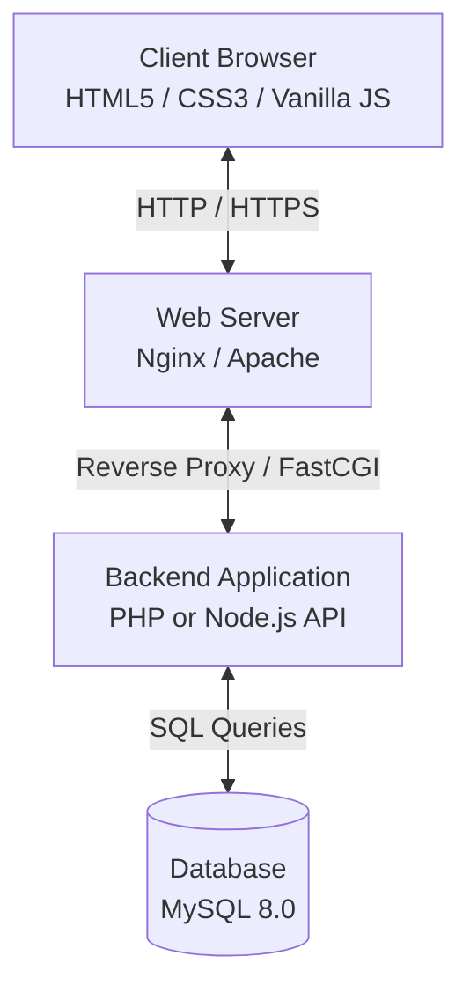
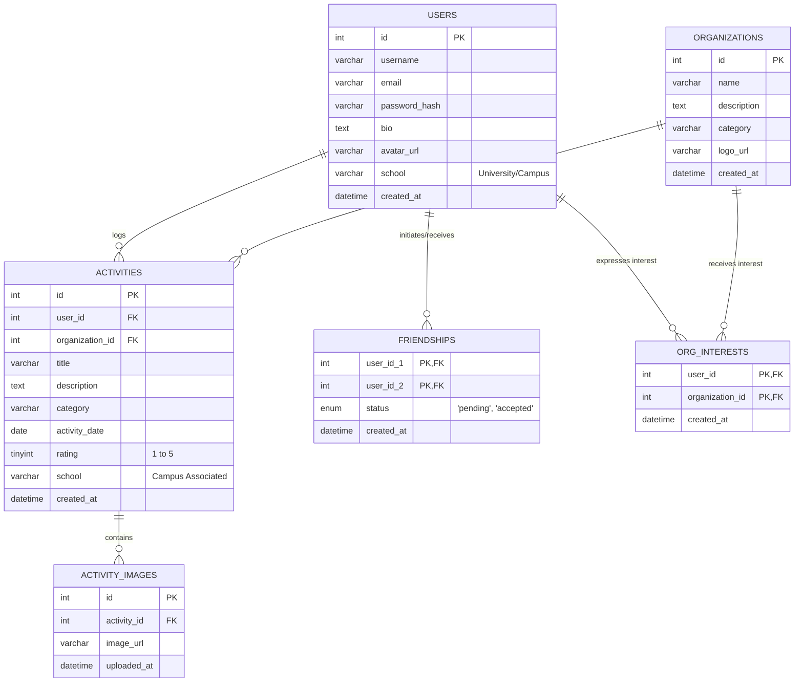

# System Design Document (SDD)

## Project: AceeStats (Student Activity Tracking Platform)

| Attribute | Details |
| :--- | :--- |
| **Document Version** | v1.1.0 |
| **Status** | Approved |
| **Database Engine** | MySQL 8.0+ / Browser LocalStorage persistent state in local environment |
| **Architecture Pattern** | Client-Server (REST API / Single-Page Application) |

---

## 1. System Architecture

The AceeStats system follows a standard three-tier software architecture:



### Architectural Components:
1. **Presentation Layer (Frontend):** 
   - Unified Single-Page Application (SPA) built with static HTML5, premium custom HSL CSS3 (with responsive layouts, glassmorphism, and streak count animations), and dynamic Vanilla JavaScript.
   - Leverages `FileReader` Base64 stream uploads for client-side image attachments.
2. **Application Layer (Backend):**
   - Implements a RESTful JSON API.
   - Simulated locally in **[app.js](app.js)** using dynamic `async/await` Promises with a simulated 150ms network delay.
3. **Database Layer (MySQL):**
   - Stores users, clubs, logs, interest vectors, and social bonds.
   - Mocked persistently in `localStorage` under version `v2.5` to clear outdated assets automatically.

---

## 2. Database Schema Design

The application utilizes a fully normalized MySQL relational database. Below is the Entity Relationship (ER) structure:



### Table Structure Definitions

#### 1. `users` Table
Stores student accounts and profile bio cards, including Philippine schools.
```sql
CREATE TABLE `users` (
  `id` INT AUTO_INCREMENT PRIMARY KEY,
  `username` VARCHAR(50) NOT NULL UNIQUE,
  `email` VARCHAR(100) NOT NULL UNIQUE,
  `password_hash` VARCHAR(255) NOT NULL,
  `bio` TEXT DEFAULT NULL,
  `avatar_url` VARCHAR(255) DEFAULT '/assets/default-avatar.png',
  `school` VARCHAR(120) DEFAULT 'University of the Philippines Diliman',
  `created_at` DATETIME DEFAULT CURRENT_TIMESTAMP
) ENGINE=InnoDB DEFAULT CHARSET=utf8mb4;
```

#### 2. `organizations` Table
Defines school clubs, teams, and departments.
```sql
CREATE TABLE `organizations` (
  `id` INT AUTO_INCREMENT PRIMARY KEY,
  `name` VARCHAR(100) NOT NULL UNIQUE,
  `description` TEXT DEFAULT NULL,
  `category` VARCHAR(50) NOT NULL, -- e.g., 'Student Government', 'Academic', 'Arts'
  `logo_url` VARCHAR(255) DEFAULT NULL,
  `created_at` DATETIME DEFAULT CURRENT_TIMESTAMP
) ENGINE=InnoDB DEFAULT CHARSET=utf8mb4;
```

#### 3. `activities` Table
Contains logs written by students detailing their participation, associated with specific schools.
```sql
CREATE TABLE `activities` (
  `id` INT AUTO_INCREMENT PRIMARY KEY,
  `user_id` INT NOT NULL,
  `organization_id` INT DEFAULT NULL,
  `title` VARCHAR(150) NOT NULL,
  `description` TEXT NOT NULL,
  `category` VARCHAR(50) NOT NULL,
  `activity_date` DATE NOT NULL,
  `rating` TINYINT NOT NULL CHECK (`rating` BETWEEN 1 AND 5),
  `school` VARCHAR(120) DEFAULT 'University of the Philippines Diliman',
  `created_at` DATETIME DEFAULT CURRENT_TIMESTAMP,
  FOREIGN KEY (`user_id`) REFERENCES `users` (`id`) ON DELETE CASCADE,
  FOREIGN KEY (`organization_id`) REFERENCES `organizations` (`id`) ON DELETE SET NULL
) ENGINE=InnoDB DEFAULT CHARSET=utf8mb4;
```

---

## 3. API Endpoint Architecture

The backend exposes a JSON-based RESTful API interface:

### 3.1 Authentication & Profile Endpoints
* `POST /api/auth/register` - Create a new student account.
* `POST /api/auth/login` - Authenticate credentials and establish session / issue JWT.
* `GET /api/profile/:id` - Fetch student profile card data (bio, avatar, rating breakdown, school, and computed streaks).
* `PUT /api/profile` - Update user bio, avatar, and associated school.

### 3.2 Activity Logs Endpoints
* `GET /api/activities` - Fetch logs for the authenticated student.
* `POST /api/activities` - Log a new activity (accepts title, org, category, rating, desc, image Base64, and school).
* `DELETE /api/activities/:id` - Delete an activity log.

### 3.3 Social Feed Endpoints
* `GET /api/social/feed` - Fetch chronologically ordered activity logs of connected friends, including their respective school badges.
* `GET /api/social/friends` - List connected friends/classmates alongside their primary schools.

### 3.4 Trending & Analytics Endpoints
* `GET /api/trending/organizations` - Fetch top ranked organizations based on logged activity counts and expressed interest counts.

---

## 4. Key Data Flows

### 4.1 Log Creation & Photo Upload Flow
1. Client fills the activity form (specifies details, rating, custom associated school, and attaches a photo), and clicks **Submit**.
2. Client packs files into a `POST` request payload.
3. Backend service processes request:
   - Validates user input.
   - Saves image Base64/url.
   - Inserts record into `activities` table including the `school` field.
4. Returns HTTP 201 Created with JSON payload.
5. Client updates local state, re-renders profile grids, and switches views.
